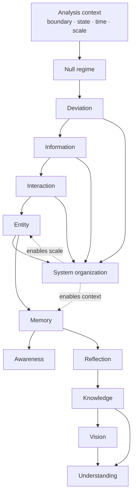

# CPAF component status map

**Status:** Working registry, updated with the canonical Draft 0.1 layer  
**Purpose:** one navigable view of definition authority, computational evidence,
and unresolved concept gaps. This registry does not promote a Draft to Accepted.

## Authority and evidence legend

- **Canonical Draft:** typed proposal in this folder; pending author acceptance.
- **Reference only:** legacy or exploratory material; useful for migration but
  not current formal authority.
- **Witnessed:** a runnable K-SOM-Heb result exists in one substrate.
- **Partial:** a witness covers an ingredient or subtype, not the full concept.
- **Open:** no adequate single-case witness or definition is complete.

## Dependency and progression view



The arrows are dependency hypotheses, not a claim that every system develops
capabilities in this temporal order. Memory and awareness remain distinct:
memory has a partial computational witness, while awareness currently has only a
registration-shaped ingredient witness.

## Foundational component registry

| Component | Canonical document | Canonical status | Evidence status | Current witness | Main gap |
|---|---|---|---|---|---|
| Analysis context | `METALANGUAGE.md` | Draft 0.2 | Supporting scaffold | Typed boundary, state, scale, clocks | Observer ontology and admissibility boundary |
| Null regime | `null_state.md` | Draft 0.3 | Witnessed | iters 1, 11, 16 | Natural vs assessor-selected null; recurrence and maintenance certificates |
| Deviation | `deviation.md` | Draft 0.2 | Witnessed | iters 6, 7, 13–14, 16 | Cognitive relevance and cross-substrate thresholds |
| Information | `information.md` | Draft 0.1 | Witnessed | iters 7, 8, 11, 16 | Counterfactual standard and partial observability |
| Interaction | `interaction.md` | Draft 0.1 | Witnessed | iters 8, 11, 12, 15–17 | Channel certificate and intervention boundary |
| Entity | `entity.md` | Draft 0.1 | Witnessed | iters 9–10, 13–14, 17 | Blind discovery, fragmentation, and boundary membership |
| System | `system.md` | Draft 0.1 | Partial/witnessed | iters 3–5, 9–10, 15–17 | System-level criteria and emergence comparison |

## Active and higher components

These concepts remain in the legacy/reference layer until their canonical
definitions and operational tests are written. A partial witness is not a
completed definition.

| Component | Reference location | Definition status | Evidence status | Next concept gap |
|---|---|---|---|---|
| Memory | `Framework/1 - Basic/memory.md` | Reference only | Partial: iters 2–5, 13–14 | Canonical retention, recall, identity, and capacity criteria |
| Experience | `Framework/1 - Basic/experience.md` | Reference only | Open | Distinguish accumulated history from memory and state change |
| Awareness | `Framework/1 - Basic/awareness.md` | Reference only | Partial ingredient: iter 17 | Require registration plus access, relevance, or control without overclaiming sentience |
| Reflection | `Framework/1 - Basic/reflection.md` | Reference only | Open | Self-directed transformation of retained representations |
| Knowledge | `Framework/2 - Intermediate/Knowledge.md` | Reference only | Open | Separate retained information, model, and justified generalization |
| Preference | `Framework/2 - Intermediate/Preference.md` | Reference only | Open | Stable valuation or ordering that changes selection |
| Agency | `Framework/2 - Intermediate/Agency.md` | Reference only | Open | Goal-directed intervention and counterfactual control |
| Vision | `Framework/2 - Intermediate/Vision.md` | Reference only | Open | Future-state projection and evaluation |
| Understanding | `Framework/2 - Intermediate/Understanding.md` | Reference only | Open | Integration, transfer, and explanatory adequacy |
| Internal modeling | `Framework/2 - Intermediate/InternalModeling.md` | Reference only | Open | Model/world distinction and model-guided prediction |

## Evidence-to-definition workflow

```text
concept gap
    ↓
typed conjecture in canonical Draft or mapping notes
    ↓
runnable witness with explicit checks
    ↓
adversarial counterexample and scope review
    ↓
canonical revision
    ↓
author acceptance
    ↓
legacy crosswalk and status update
```

The status map intentionally records negative results and partial results. A
witness earns a claim only for its stated substrate, variables, scale, window,
and certificate level.

## Open concept gaps

1. **Authority:** no canonical concept document is currently `Accepted`.
2. **Universality:** all foundational witnesses use K-SOM-Heb; a second
   substrate is still needed.
3. **Scale:** entity and system certification need explicit multi-scale and
   boundary-selection tests.
4. **Certificates:** information and interaction need a standard treatment of
   hidden confounders, interventions, and partial observability.
5. **Identity:** memory recovery, capacity, structural lesions, and
   wrong-memory recovery need one canonical operational contract.
6. **Active layer:** awareness, reflection, experience, knowledge, preference,
   agency, vision, and understanding lack complete single-case witnesses.
7. **Clocks:** admissible re-clocking/resampling limits and observer ontology
   remain unresolved.
8. **Progression:** prerequisite closure and capability profiles are proposed,
   not yet validated as an assessment scale.

## Review checklist for promoting a component

- [ ] Status and version are explicit.
- [ ] Symbols, scale, window, clocks, and observation map are typed.
- [ ] Definition is separated from operational criterion and evidence.
- [ ] Necessary/sufficient conditions and counterexamples are stated.
- [ ] At least one runnable witness or an explicit reason for its absence exists.
- [ ] Legacy disagreements are cross-referenced rather than silently edited.
- [ ] Author acceptance is recorded before changing status to `Accepted`.
